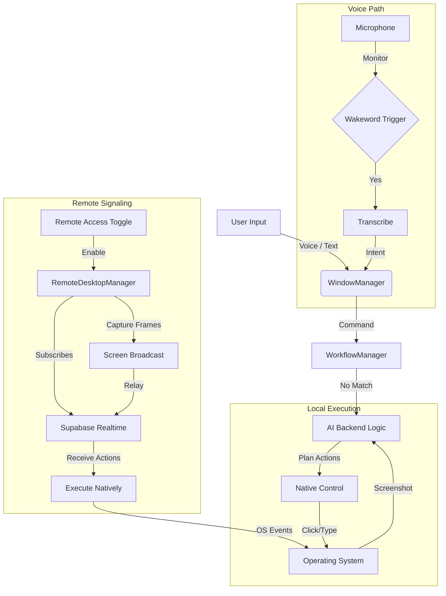

# Desktop Application Flow Analysis

The Control Desktop Application is an Electron-based tool designed for native OS control, high-performance AI tasks, and providing remote accessibility. It allows users to control their local computer using voice or text and offers a "Remote Access" feature to bridge control with the web dashboard.

## Architecture Overview

1.  **Electron Main Process:**
    *   **WindowManager:** Handles UI windows (Classic, Lite, Sidebar).
    *   **WakewordManager:** Listens for "Hey Control" using Porcupine.
    *   **WorkflowManager:** Executes pre-defined automation scripts (Skills).
    *   **RemoteDesktopManager:** Manages signaling and streaming for the "View and Control" feature.
    *   **SupabaseService:** Handles authentication and synchronization with the hosted infrastructure.
2.  **Renderer Processes:**
    *   **Classic UI:** The main chat and settings interface.
    *   **Lite Mode:** A floating, minimalist input interface for quick commands.
3.  **Local Services:**
    *   **Vosk Server:** Optional local speech-to-text for offline capability.
    *   **Edge TTS:** High-quality text-to-speech using a Python bridge.

## Key Flows

### 1. Local AI Execution
- The user provides a command via voice (Wakeword) or text input.
- `WorkflowManager` checks for matching skills/workflows.
- If no match, the `BackendManager` calls the AI provider (e.g., Gemini) with local desktop context (screenshots, window titles).
- The AI generates actions (click, type, scroll), which are executed via `nut-js` or native PowerShell scripts.

### 2. Voice Interaction
- `WakewordManager` constantly monitors the microphone for the "Hey Control" trigger.
- Upon trigger, the app records audio and uses either local Vosk or the AI's native audio capabilities to transcribe the intent.
- Transcribed text is then processed as a standard AI task.

### 3. Remote Access Service (Signaling)
- When "Remote Access" is enabled, `RemoteDesktopManager` joins a Supabase Realtime channel (`remote_control:{device_id}`).
- **Heartbeat:** Every 30 seconds, it updates the `paired_devices` table in Supabase to signal it is online.
- **Screen Capture:** It uses `desktopCapturer` to grab the primary display frames at ~30 FPS and broadcasts them as base64-encoded strings to the channel.
- **Command Execution:** It listens for `action` broadcasts (move, click, key_press) and executes them on the host OS.

## Flowchart: Desktop Internal Logic

