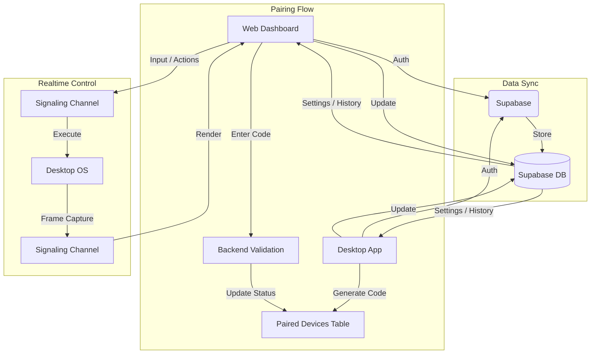

# Sync Logic & Cross-Platform Connection

The synchronization between the Control Web Dashboard and the Control Desktop Application is facilitated through a robust infrastructure using Supabase as the central "source of truth." This allows for seamless transitions between managing cloud-based VMs and local physical hardware.

## Architecture Overview

1.  **Supabase Database (PostgreSQL):**
    *   **User Profiles (`users` table):** Stores account-wide settings, daily/monthly task counts, and plan limits. Both web and desktop apps read/write to this table to keep preferences in sync.
    *   **Sessions & Messages (`chat_sessions`, `chat_messages` tables):** This is the core repository for all AI conversations. The web app uses direct Supabase fetching for high speed, while the desktop app syncs its local database with these tables.
    *   **Paired Devices (`paired_devices` table):** Manages the status of physical devices linked to a user's account.

2.  **Supabase Realtime (Broadcast & Presence):**
    *   **Signaling Channel (`remote_control:{device_id}`):** The primary communication bus for the "View and Control" feature. It handles screen streaming (desktop -> web) and user input (web -> desktop).
    *   **Presence:** Used to detect when a desktop instance is online and ready for remote control.

## Key Flows

### 1. Device Pairing (The Bridge)
- **Desktop:** The user selects "Pair Device" and receives a 6-digit `pairing_code`. The desktop app creates a `pending` device entry in the `paired_devices` table.
- **Web:** The user enters this code on the `/pair` page. The web app validates the code through the backend, which updates the device status to `paired`.
- **Sync:** Once paired, the desktop app recognizes the status change and begins its heartbeat to keep the bridge active.

### 2. Remote Desktop Control (The Link)
- **Web:** The user selects a "Remote Machine" as the target for an AI session.
- **Signaling:** The web app joins the signaling channel for that `device_id`.
- **Streaming:** The desktop app detects a "viewer" has joined the channel and begins broadcasting screen frames.
- **Interaction:** AI actions or manual user inputs from the web UI are broadcast to the channel and executed on the desktop app natively.

### 3. Account-Wide Synchronization
- **Settings:** API keys, AI model preferences, and theme settings are saved to the `users` table and updated in real-time across both platforms.
- **History:** AI chat sessions created on the desktop app appear on the web dashboard (and vice versa) by syncing with the `chat_sessions` table.

## Flowchart: Web-Desktop Synchronization

