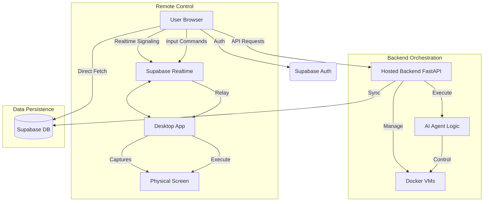

# Web Dashboard Flow Analysis

The Control Web Dashboard is a Next.js application that provides a centralized interface for managing AI sessions, virtual machines, and remote devices. It interacts with both a hosted FastAPI backend and Supabase for data persistence and real-time signaling.

## Architecture Overview

1.  **Next.js Frontend:** Handles the UI/UX, state management (Zustand), and user interactions.
2.  **Supabase:**
    *   **Authentication:** Manages user login and session tokens.
    *   **Database:** Primary storage for chat sessions, messages, and user profiles.
    *   **Realtime:** Facilitates low-latency signaling between the web client and remote desktop instances via Broadcast channels.
3.  **Hosted Backend (FastAPI):**
    *   **VM Management:** Orchestrates Docker-based Virtual Machines (start, stop, create).
    *   **AI Agent Execution:** Runs the core agent logic (computer-use) for VM-based tasks.
    *   **File Handling:** Manages file uploads for chat sessions.

## Key Flows

### 1. Session Creation & AI Interaction
- The user starts a new session in the web UI.
- The web app calls the backend `/api/chat/create`.
- Chat messages are stored in Supabase.
- When a message is sent (`/api/chat/{id}/send`), the backend processes the request using an AI provider (e.g., Gemini) and streams responses back as Server-Sent Events (SSE).

### 2. Virtual Machine Control
- The dashboard lists VMs via `/api/vm/list`.
- Starting a VM calls `/api/vm/{id}/start`. The backend starts a Docker container with a VNC/noVNC server.
- The web UI embeds the VM desktop using an `<iframe>` pointing to the noVNC URL provided by the backend.

### 3. Remote Desktop Control
- For paired physical devices, the web UI uses `RemoteDesktopViewer`.
- It establishes a Supabase Realtime channel (`remote_control:{device_id}`).
- **Screen Streaming:** The desktop app captures frames and broadcasts them to the channel; the web app renders them on a `<canvas>` or ``.
- **User Input:** Mouse and keyboard events in the web UI are broadcast back to the desktop app, which executes them natively using `nut-js` or PowerShell.

## Flowchart: Web Dashboard Operations

